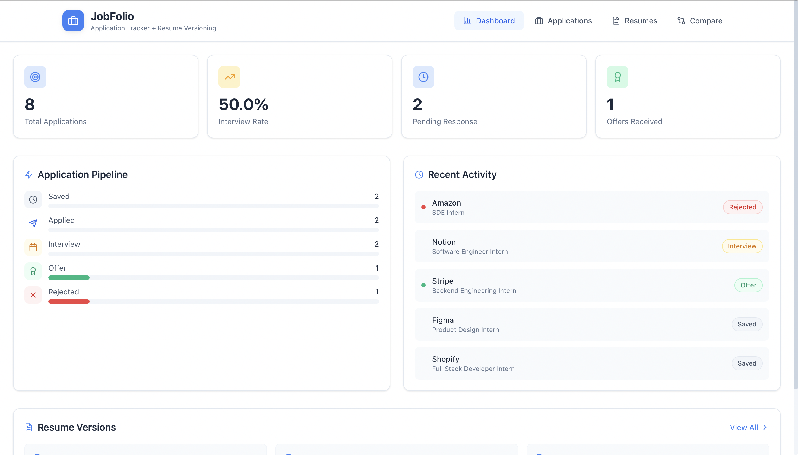
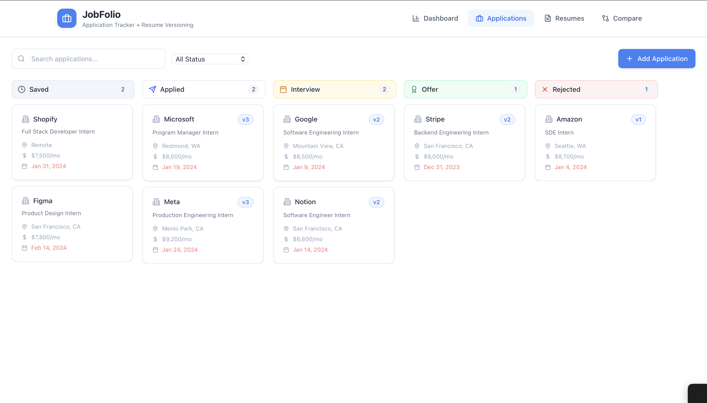
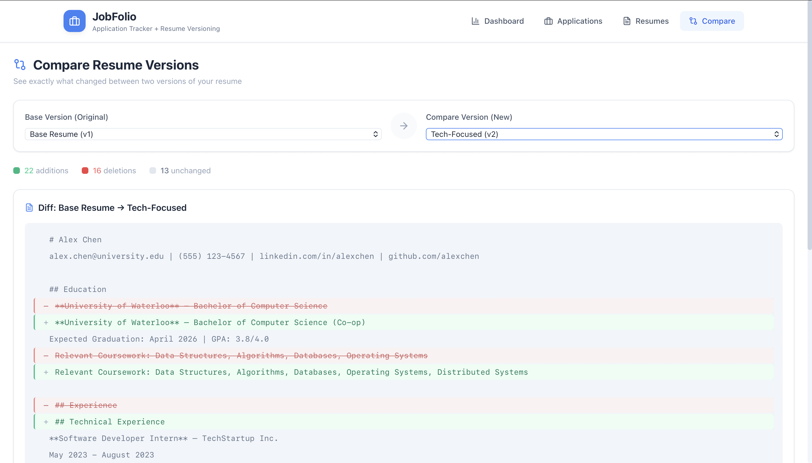

# JobFolio

A full-stack job application tracker with resume versioning, analytics dashboard, and Kanban board to help you organize and monitor your job search.


## Features

### 📊 Analytics Dashboard
- Track **interview rate**, **offers received**, **pending applications**, and **total applications**
- Visualize your job search progress at a glance
- Identify trends and optimize your application strategy

### 📄 Resume Versioning
- Upload and store multiple versions of your resume
- Compare versions side-by-side to track changes
- Keep track of which resume you sent to which company

### 📋 Kanban Board
- Visualize applications across stages: **Applied → Interviewing → Offered → Rejected**
- Quickly see where each application stands
- Stay organized throughout your job search

### 🔍 Search & Filter
- Search applications by company, role, or keywords
- Filter by status, date, or tags
- Find any application instantly

### 📝 Notes
- Add notes to each application
- Track interview questions, contacts, and follow-ups
- Never forget important details

### 🔐 Secure Authentication
- JWT token-based authentication
- Bcrypt password hashing
- Protected routes and secure session management

## Tech Stack

### Frontend
- **React** - UI library
- **Next.js** - React framework
- **TypeScript** - Type safety
- **Tailwind CSS** - Styling

### Backend
- **Node.js** - Runtime
- **Express.js** - Web framework
- **MongoDB** - Database
- **Mongoose** - ODM

### Authentication
- **JWT** - JSON Web Tokens
- **Bcrypt** - Password hashing

### Testing
- **Jest** - Testing framework

## Getting Started

### Prerequisites
- Node.js (v18 or higher)
- MongoDB (local or Atlas)
- npm or yarn

### Installation

1. **Clone the repository**
   ```bash
   git clone https://github.com/kasimsuh/jobfolio.git
   cd jobfolio
   ```

2. **Install dependencies**
   ```bash
   # Install backend dependencies
   cd server
   npm install

   # Install frontend dependencies
   cd ../client
   npm install
   ```

3. **Set up environment variables**

   Create a `.env` file in the `server` directory:
   ```env
   PORT=5000
   MONGODB_URI=your_mongodb_connection_string
   JWT_SECRET=your_jwt_secret_key
   ```

   Create a `.env.local` file in the `client` directory:
   ```env
   NEXT_PUBLIC_API_URL=http://localhost:5000/api
   ```

4. **Run the application**
   ```bash
   # Start backend (from server directory)
   npm run dev

   # Start frontend (from client directory)
   npm run dev
   ```

5. **Open your browser**
   ```
   http://localhost:3000
   ```

## API Endpoints

### Authentication
| Method | Endpoint | Description |
|--------|----------|-------------|
| POST | `/api/auth/register` | Register new user |
| POST | `/api/auth/login` | Login user |
| GET | `/api/auth/me` | Get current user |

### Applications
| Method | Endpoint | Description |
|--------|----------|-------------|
| GET | `/api/applications` | Get all applications |
| GET | `/api/applications/:id` | Get single application |
| POST | `/api/applications` | Create application |
| PUT | `/api/applications/:id` | Update application |
| DELETE | `/api/applications/:id` | Delete application |

### Resumes
| Method | Endpoint | Description |
|--------|----------|-------------|
| GET | `/api/resumes` | Get all resumes |
| POST | `/api/resumes` | Upload resume |
| DELETE | `/api/resumes/:id` | Delete resume |

### Analytics
| Method | Endpoint | Description |
|--------|----------|-------------|
| GET | `/api/analytics` | Get dashboard stats |

## Project Structure

```
jobfolio/
├── client/                 # Frontend (Next.js)
│   ├── components/         # Reusable UI components
│   ├── pages/              # Next.js pages
│   ├── styles/             # Global styles
│   ├── hooks/              # Custom React hooks
│   ├── utils/              # Utility functions
│   └── types/              # TypeScript types
│
├── server/                 # Backend (Express)
│   ├── controllers/        # Route controllers
│   ├── models/             # Mongoose models
│   ├── routes/             # API routes
│   ├── middleware/         # Custom middleware
│   └── utils/              # Utility functions
│
└── README.md
```

## Screenshots

### Dashboard


### Kanban Board


### Resume Comparison



## Future Improvements

-  Drag-and-drop Kanban board
-  Email reminders for follow-ups
-  Browser extension to save jobs from LinkedIn/Indeed
-  Export applications to CSV
-  Dark mode

## Contributing

Contributions are welcome! Feel free to open an issue or submit a pull request.

1. Fork the repository
2. Create your feature branch (`git checkout -b feature/AmazingFeature`)
3. Commit your changes (`git commit -m 'Add some AmazingFeature'`)
4. Push to the branch (`git push origin feature/AmazingFeature`)
5. Open a Pull Request

## License

This project is licensed under the MIT License - see the [LICENSE](LICENSE) file for details.

## Contact

**Suhiyini Kasim**
- GitHub: [@kasimsuh](https://github.com/kasimsuh)
- LinkedIn: [Suhiyini Kasim](https://www.linkedin.com/in/suhiyini-kasim-ba4b99333/)
- Email: s.kasim@mail.utoronto.ca
